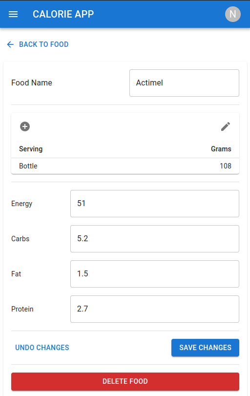
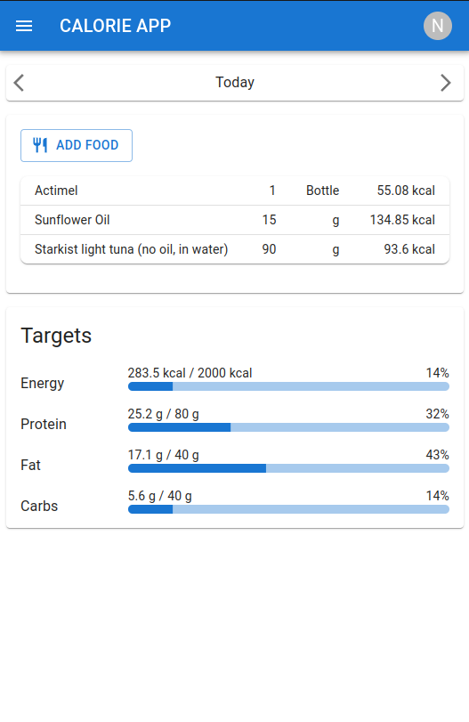
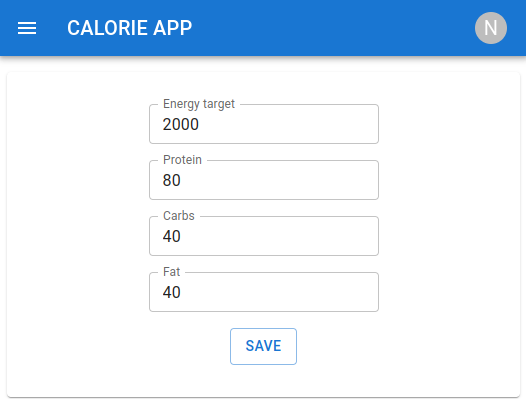
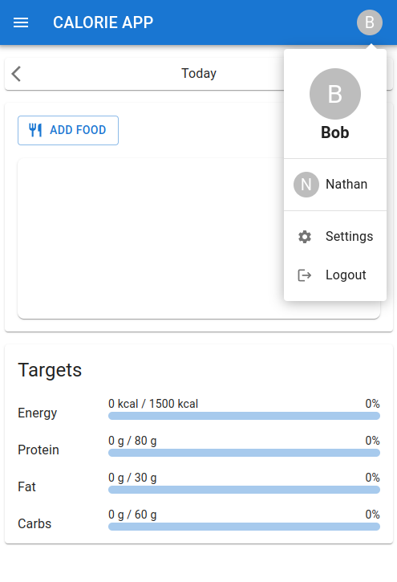

### Overview

This is a calorie tracking web application that allows the user to add their own custom food items by specifying macronutrients and calories, as well as having the option to add different serving sizes. 



Food items can then be selected in the user's daily diary and the total daily intake will be displayed.



Additionally, total daily goals can be adjusted.



The user can have multiple profiles. Each profile will share the food collection but they will each have different diaries and daily goals.



### Requirements

A backend must be operating at the same time for the project to function.

You need to create an .env file to link to the API:

```
HOST=192.0.0.5
REACT_APP_API_URL=http://192.0.0.5:5167
```
### `npm start`

Runs the app in the development mode.\
Open [http://localhost:3000](http://localhost:3000) to view it in the browser.